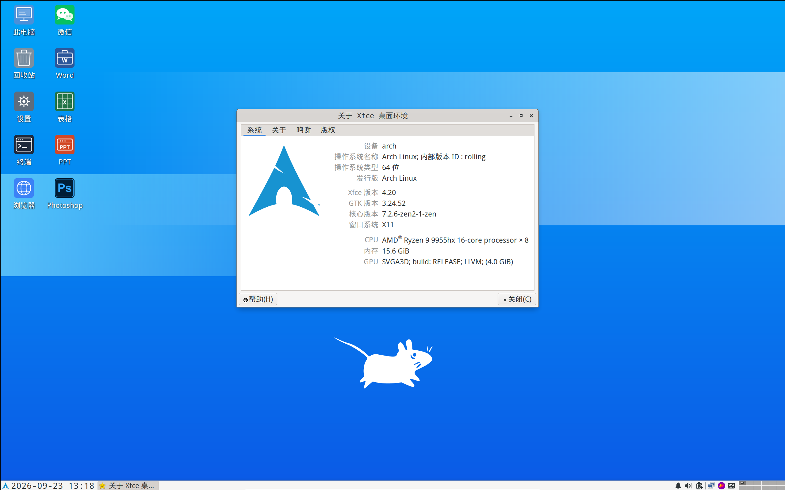

# Arch Installer

中文 | [English](docs/README-EN.md)

以自己本地稳定运行 **五年+** 的 Arch Linux + Xfce4 桌面系统为蓝本，在保证轻量、美观的前提下，
尽可能包含更多的维护工具。

既可用作快速安装镜像，也可替代 ArchISO 用作 Live 维护系统。

## 安装

从 [Releases] 下载并启动 Live 镜像，点击桌面 **Installer** 图标即可实现全自动化安装。

[Releases]: https://github.com/kitty-panics/arch-installer/releases

## 特性

- 完全中文本地化 + 易操作的图形化界面 (X11 + Xfce4)。
- 日用软件 (微信、Work/Excel/PPT、PS、邮箱...) 均使用在线版。
- 可完全只使用鼠标、键盘操作。
- 包含引导、性能、磁盘、网络、日志...等各种排障工具。



## 旧版

由于 Arch 官方时不时要变动一下安装流程，旧版安装脚本不再维护。

#### 使用

如果你还想继续使用，执行下面的命令即可安装 Arch Linux 系统。

```Bash
bash <(curl -sL https://raw.githubusercontent.com/kitty-panics/arch-installer/master/bin/setup.sh)
```

**备注：**

执行这条命令前，请确认你的设备满足以下条件。

- 设备处于一个 ``高速且稳定`` 的网络环境中。
- 设备中的 ``重要文件`` 已备份。
- 仔细阅读安装脚本中的提示信息。

## 许可证

[MIT](../LICENSE)
